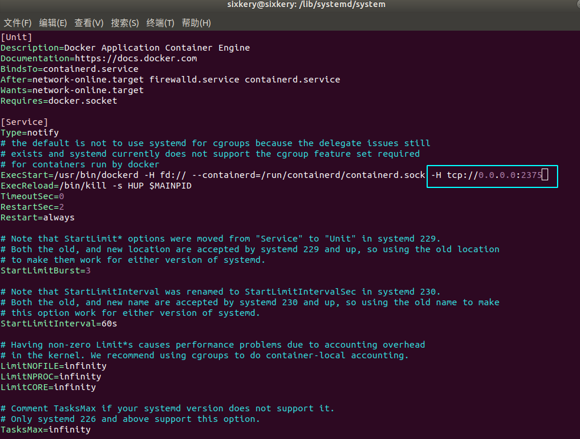
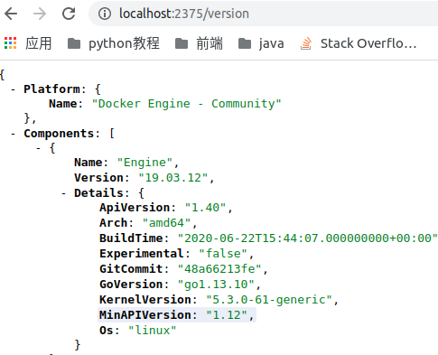

### Docker 配置远程连接端口

1. 修改宿主机配置文件

   ```shell
   vim /lib/systemd/system/docker.service
   ```

2. 在 ExecStart 开头的这一行末尾添加 `-H tcp://0.0.0.0:2375`

   

3. 重启 docker

   ```shell
   systemctl daemon-reload
   
   systemctl restart docker
   ```

4. 防火墙开启端口

   ```shell
   firewall-cmd --zone =public --add-port=2375/tcp --permanent
   ```

5. 通过外网访问 : 

   ```shell
   http://localhost/:2375/version
   ```

   

   


### Docker 部署 springboot 项目

1. 打包 springboot 项目

   ```shell
   mvn clean package -Dmaven.test.skip=true
   ```

2. 创建 Dockerfile 文件

   ```dockerfile
   # 基于 Java 8 的环境
   FROM java:8
   
   # 维护者信息
   MAINTAINER sixkery
    
    # 把 jar 包复制到镜像服务中的根目录,改名为 app.jar
   ADD *.jar /app.jar
   
   # 执行创建 app.jar
   RUN bash -c 'touch /app.jar'
   
   # 对外暴露的端口
   EXPOSE 8080
   
   # 运行
   ENTRYPOINT ["java", "-jar", "app.jar"] 
   ```

3. 把 springboot 打的 jar 包和 Dockerfile 文件放在同一个文件夹 vueblog 下。

4. 进入文件夹 vueblog 下构建镜像。

   ```shell
   docker build -t vueblog .
   
   # 查看镜像
   docker images
   
   ```

5. 运行镜像

   ```shell
   docker run -p 8080:8080 -d vueblog
   
   -p: 主机端口:容器端口
   -d: 后台运行，并返回容器 ID
   --name="vueblog": 为容器指定一个名称 
   ```

